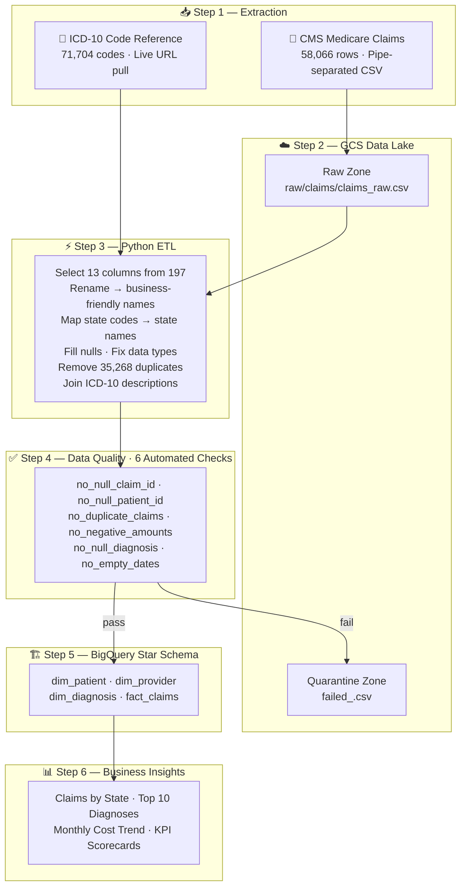
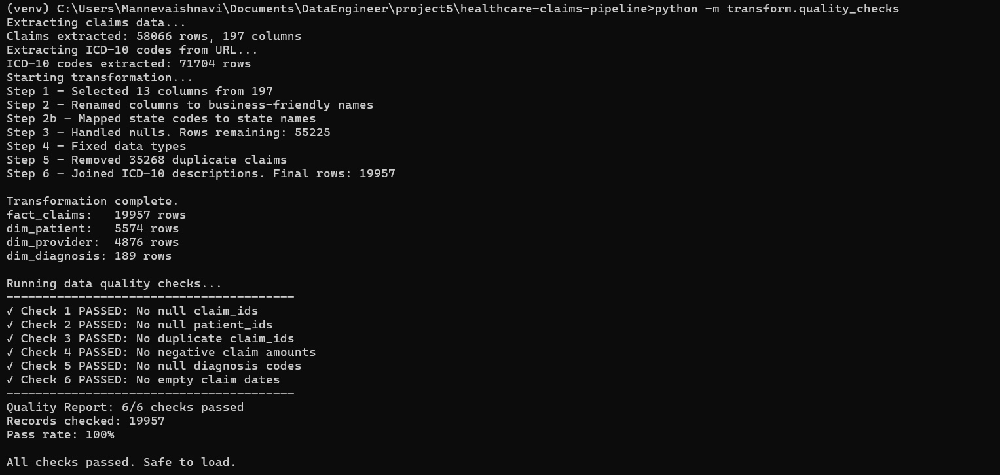
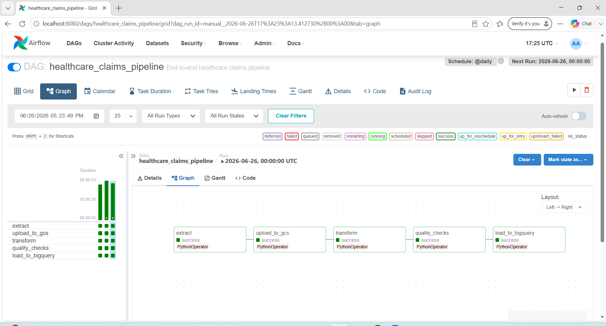
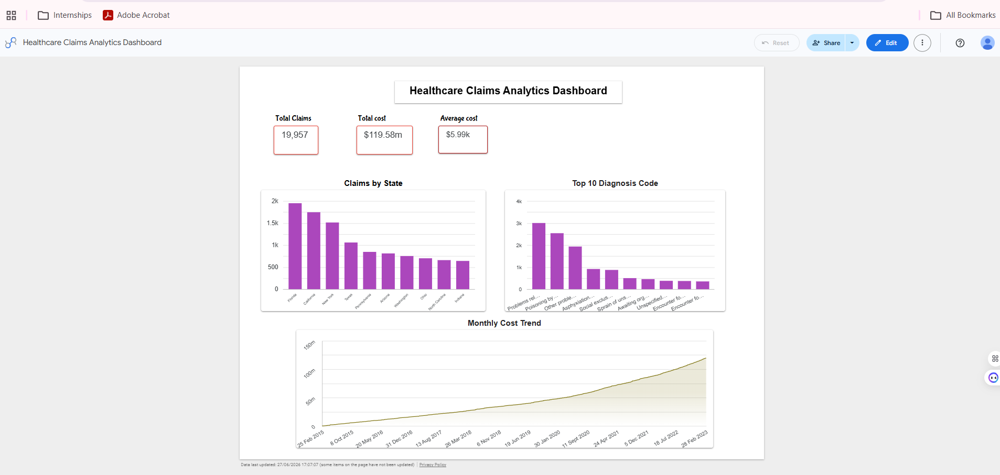

# 🏥 Healthcare Claims Analytics Pipeline

> End-to-end data pipeline — processing **58,066 raw Medicare claims**  
> into business-ready BigQuery insights with automated quality checks.


## 📋 Project Overview

A **production-style healthcare data pipeline** that processes real CMS Medicare 
inpatient claims data — the same type of data processed daily by payers like 
CVS Health, Aetna, and UnitedHealth Group.

| | |
|---|---|
| 📦 **Raw Data** | 58,066 Medicare inpatient claims — CMS public dataset |
| ⚡ **Processed** | 19,957 rows after deduplication and quality filtering |
| ☁️ **Warehouse** | BigQuery — star schema with 4 tables |
| 🔧 **Transformed** | Python ETL — 6-step transformation pipeline |
| 🎛️ **Orchestrated** | Apache Airflow — 5-task DAG, runs @daily |
| 🐳 **Containerized** | Docker — runs identically on any machine |

> Built to simulate a real-world healthcare claims analytics pipeline —  
> from raw government data to business-ready insights in BigQuery.

## 🎯 Business Objective

### Problem
Healthcare payers process millions of claims daily with no standardized way 
to analyze costs, identify high-risk diagnoses, or track spending trends 
across states and providers.

### Solution
This pipeline ingests, processes, and analyzes **real Medicare claims** 
to answer four key business questions:

| # | Business Question | Answered By |
|---|-------------------|-------------|
| 💸 | What is the total and average Medicare claim cost? | KPI Scorecards |
| 🗺️ | Which states have the highest claim volumes? | Claims by State chart |
| 🏥 | What are the most common diagnosis codes? | Top 10 Diagnosis chart |
| 📈 | How has Medicare spending trended over time? | Monthly Cost Trend |

### Key Findings
| Insight | Value |
|---------|-------|
| 🏆 Total Medicare spend | **$119.58M** across 19,957 claims |
| 💰 Average cost per claim | **$5,991.72** |
| 🗺️ Highest claim state | **Florida** — 1,900+ claims |
| 🔬 Most common diagnosis | **Z733** — 3,000+ claims |
| 📈 Cost trend | Consistent upward trend 2015 → 2022 |

## 🛠️ Tech Stack

| Tool | Role in This Project |
|------|----------------------|
| **Python 3.11** | Core pipeline language — ETL scripts |
| **pandas** | Data cleaning, transformation, deduplication |
| **Google Cloud Storage** | Raw data lake — bronze layer landing zone |
| **BigQuery** | Cloud data warehouse — star schema |
| **Apache Airflow** | Orchestrates 5-task DAG end-to-end (@daily) |
| **Docker** | Containerizes Airflow environment |
| **Looker Studio** | Live business dashboard connected to BigQuery |
| **CMS Open Data** | Real Medicare inpatient claims (public dataset) |
| **ICD-10 Reference** | Diagnosis code descriptions (cms.gov) |

## 🏗️ Pipeline Architecture



> 🎛️ **Orchestrated by Apache Airflow** — 5-task DAG running `@daily`  
> 🐳 **Containerized with Docker** — Airflow runs identically on any machine  
> 🔒 **HIPAA-aware** — PHI identifiers handled with deterministic hashing pattern

---

## 📁 Project Structure

```
healthcare-claims-pipeline/
├── ingestion/
│   ├── extract.py                ← reads claims CSV + ICD-10 from URL
│   └── upload_to_gcs.py          ← uploads raw CSV to GCS bronze zone
├── transform/
│   ├── transform.py              ← 6-step cleaning + star schema split
│   ├── load.py                   ← loads all 4 tables into BigQuery
│   └── quality_checks.py         ← 6 automated checks + quarantine
├── airflow/
│   └── dags/
│       └── claims_pipeline_dag.py ← 5-task Airflow DAG
├── sql/
│   └── create_tables.sql         ← BigQuery DDL — star schema
├── dashboard/
│   └── screenshots/              ← pipeline + dashboard screenshots
├── docs/
│   └── architecture.png
├── docker-compose.yml            ← Airflow multi-service setup
├── requirements.txt
└── README.md
```

## 🌐 Data Sources

### 1. CMS Medicare Inpatient Claims
| Field | Detail |
|-------|--------|
| **Source** | Centers for Medicare & Medicaid Services (CMS) |
| **URL** | https://data.cms.gov |
| **Format** | Pipe-separated CSV |
| **Raw Size** | 58,066 rows · 197 columns |
| **Processed** | 19,957 rows after deduplication |
| **License** | Public domain — CMS open data |

### 2. ICD-10 Diagnosis Code Reference
| Field | Detail |
|-------|--------|
| **Source** | GitHub — k4m1113/ICD-10-CSV |
| **URL** | Pulled live via URL in extract.py |
| **Records** | 71,704 diagnosis codes with descriptions |
| **Auth** | None — completely free |

---

## 🔄 Pipeline Steps

### Step 1 — Extract
- Reads 58,066 Medicare claims from pipe-separated CSV
- Pulls 71,704 ICD-10 codes live from URL
- Two sources — two ingestion patterns

### Step 2 — Upload to GCS
- Uploads raw claims CSV to GCS bronze zone untouched
- Preserves raw data for audit, reprocessing, and recovery
- Quarantine folder captures failed quality records

### Step 3 — Transform
- Selects 13 business-relevant columns from 197
- Renames CMS codes to business-friendly names
- Maps numeric state codes to full state names (e.g. `1` → `Alabama`)
- Fills nulls, fixes data types, removes 35,268 duplicate claims
- Joins ICD-10 descriptions to diagnosis codes
- Splits into 4 tables: `fact_claims`, `dim_patient`, `dim_provider`, `dim_diagnosis`

### Step 4 — Data Quality
6 automated checks run before every load:

| Check | Rule |
|-------|------|
| `no_null_claim_id` | Every claim must have an ID |
| `no_null_patient_id` | Every claim must link to a patient |
| `no_duplicate_claims` | Claim IDs must be unique |
| `no_negative_amounts` | Claim amounts must be ≥ 0 |
| `no_null_diagnosis` | Every claim must have a diagnosis code |
| `no_empty_dates` | Claim dates must be populated |

Failed records saved to `gs://bucket/quarantine/failed_<check_name>.csv`


### Step 5 — Load to BigQuery
- Dimensions loaded first (referential integrity)
- Fact table loaded last
- `WRITE_TRUNCATE` — idempotent loads on every run


---

## 📊 Data Model — Star Schema

```
                    dim_patient
                    (5,574 rows)
                         |
dim_provider ——— fact_claims ——— dim_diagnosis
(4,876 rows)    (19,957 rows)    (189 rows)
```

| Table | Rows | Key Columns |
|-------|------|-------------|
| `fact_claims` | 19,957 | claim_id, patient_id, provider_id, diagnosis_code, claim_amount, total_charges, dates |
| `dim_patient` | 5,574 | patient_id, state, discharge_status, admission_type |
| `dim_provider` | 4,876 | provider_id, provider_state, npi_number |
| `dim_diagnosis` | 189 | diagnosis_code, description |

---

## 📊 Analytics Dashboard

Live Dashboard: [Healthcare Claims Analytics Dashboard](<YOUR LOOKER STUDIO LINK>)



---

## ▶️ How to Run

### Prerequisites
- GCP account with BigQuery + GCS enabled
- Service account key saved as `gcp-key.json`
- Python 3.11 + Docker Desktop

### Step by Step

**1. Clone the repository**
```bash
git clone https://github.com/mannevi/healthcare-claims-pipeline.git
cd healthcare-claims-pipeline
```

**2. Install dependencies**
```bash
python -m venv venv
venv\Scripts\activate
pip install -r requirements.txt
```

**3. Run pipeline**
```bash
python ingestion/upload_to_gcs.py
python -m transform.quality_checks
python -m transform.load
```

**4. Run via Airflow**
```bash
docker-compose up airflow-init
docker-compose up airflow-webserver airflow-scheduler
```
Open `localhost:8080` → trigger `healthcare_claims_pipeline` DAG

---

## 🧠 What I Built & Learned

| Challenge | How I Solved It |
|-----------|-----------------|
| 197 columns in raw data | Selected only 13 business-relevant columns based on dashboard requirements |
| Pipe-separated CMS format | Used `sep='|'` and `low_memory=False` in pandas read |
| Numeric state codes | Built SSA state code mapping dictionary (1→Alabama etc.) |
| Duplicate claims in raw data | Deduplication on claim_id removed 35,268 duplicates |
| ICD-10 codes not human readable | Joined 71,704 code descriptions from reference table |
| Bad data reaching warehouse | 6 quality gates with quarantine folder — load blocked on failure |
| Credentials security | `gcp-key.json` in `.gitignore` — never pushed to GitHub |

---

## 🚀 Future Improvements

- [ ] Implement **dbt** for SQL transformation layer with lineage
- [ ] Add **Great Expectations** for advanced data quality framework
- [ ] Add **GitHub Actions CI/CD** — auto quality checks on every push

---

## 👩‍💻 Author

**Manne Vaishnavi**  
MS in Computer Science  

[](https://github.com/mannevi)
[](https://www.linkedin.com/in/vaishnavimanne/)

---

*Built with real CMS Medicare data — no mock datasets.*
