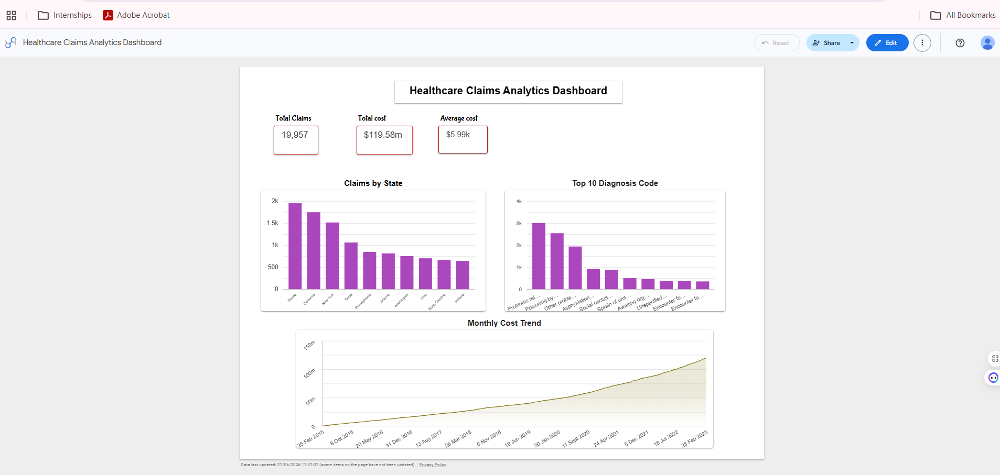
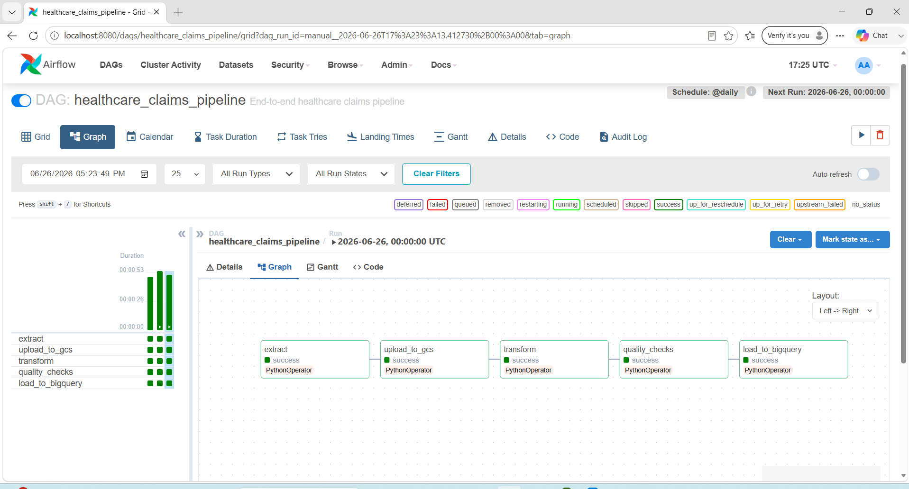
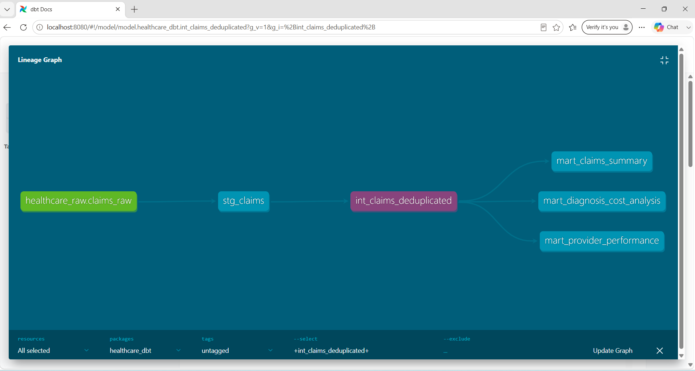

# 🏥 Healthcare Claims Analytics Pipeline

> End-to-end data pipeline processing **58,066 real Medicare claims**  
> through a medallion architecture — GCS bronze → dbt transformation → BigQuery → Looker Studio.


---

## 📋 Project Overview

A production-style healthcare data pipeline built around the same problem US payers like CVS Health, Aetna, and UnitedHealth Group solve daily — making raw claims data analytics-ready.

| | |
|---|---|
| 📦 **Raw Data** | 58,066 Medicare inpatient claims — CMS public dataset |
| ☁️ **Bronze Layer** | Google Cloud Storage — raw CSV untouched |
| 🔧 **Transformation** | dbt — 6 models across staging, intermediate, and mart layers |
| 🏗️ **Warehouse** | BigQuery — 3 mart tables + 2 staging views + 1 intermediate view |
| 🎛️ **Orchestration** | Apache Airflow — 6-task DAG running @daily |
| 📊 **Dashboard** | Looker Studio — live connected to BigQuery mart tables |

---

## 🎯 Business Problem

Healthcare payers process millions of claims daily but struggle to answer basic questions:
- Which states have the highest claim volumes?
- Which diagnoses cost the most?
- How is Medicare spend trending over time?
- Which providers are charging significantly above average?

This pipeline answers all of them.

### Key Findings

| Insight | Value |
|---------|-------|
| Total Medicare spend | **$119.58M** across 19,957 unique claims |
| Average cost per claim | **$5,991.72** |
| Highest claim state | **Florida** |
| Most common diagnosis | **Z733** — Problems related to life-management difficulty |
| Cost trend | Consistent upward trend 2015 → 2022 |

---

## 🛠️ Tech Stack

| Tool | Role |
|------|------|
| **Python 3.11** | Ingestion scripts — extract, upload, raw load |
| **Google Cloud Storage** | Bronze layer — raw data landing zone |
| **BigQuery** | Data warehouse — raw + analytics datasets |
| **dbt Core** | SQL transformation — staging, intermediate, marts |
| **Apache Airflow** | Pipeline orchestration — 6-task DAG |
| **Docker** | Containerizes Airflow environment |
| **Looker Studio** | Business dashboard connected to mart tables |

---

## 🏗️ Architecture

```
CMS Claims CSV + ICD-10 Codes
          ↓
    Python Ingestion
          ↓
   GCS Bronze Layer
   (raw/claims/ · raw/icd10/)
          ↓
  BigQuery RAW Dataset
  (healthcare_raw)
          ↓
       dbt Run
  ┌─────────────────────────────┐
  │  staging/                   │
  │    stg_claims (view)        │
  │    stg_icd_codes (view)     │
  │                             │
  │  intermediate/              │
  │    int_claims_dedup (view)  │
  │                             │
  │  marts/                     │
  │    mart_claims_summary      │
  │    mart_provider_perf       │
  │    mart_diagnosis_cost      │
  └─────────────────────────────┘
          ↓
  BigQuery Analytics Dataset
  (healthcare_analytics)
          ↓
    Looker Studio Dashboard

  Airflow orchestrates all steps @daily
```

---

## 📁 Project Structure

```
healthcare-claims-pipeline/
├── ingestion/
│   ├── extract.py                 ← reads claims CSV + ICD-10 from URL
│   └── upload_to_gcs.py           ← uploads both files to GCS bronze zone
├── transform/
│   └── quality_checks.py          ← file-level pipeline quality checks
├── healthcare_dbt/
│   └── models/
│       ├── staging/
│       │   ├── sources.yml        ← defines healthcare_raw source tables
│       │   ├── stg_claims.sql     ← renames 197 CMS columns → 13 clean names
│       │   └── stg_icd_codes.sql  ← cleans ICD-10 reference codes
│       ├── intermediate/
│       │   └── int_claims_deduplicated.sql ← ROW_NUMBER() deduplication
│       ├── marts/
│       │   ├── mart_claims_summary.sql         ← monthly spend by state
│       │   ├── mart_provider_performance.sql   ← provider cost analysis
│       │   └── mart_diagnosis_cost_analysis.sql ← cost per diagnosis
│       └── schema.yml             ← dbt tests — 11 checks across all models
├── airflow/
│   └── dags/claims_pipeline_dag.py ← 6-task Airflow DAG with dbt
├── sql/
│   └── create_tables.sql          ← original star schema DDL
├── archive/
│   ├── transform_v1.py            ← original Python ETL (replaced by dbt)
│   └── load_v1.py                 ← original load script (replaced by dbt run)
├── dashboard/screenshots/         ← pipeline + dashboard screenshots
├── docker-compose.yml             ← Airflow multi-service setup
├── requirements.txt
└── README.md
```

---

## 🌐 Data Sources

| Source | Detail |
|--------|--------|
| **CMS Medicare Claims** | data.cms.gov — pipe-separated CSV — 58,066 rows · 197 columns |
| **ICD-10 Reference** | github.com/k4m1113/ICD-10-CSV — 71,704 codes pulled live via URL |

---

## 🔄 Pipeline Steps

### Step 1 — Extract
Reads raw claims from local CSV and pulls ICD-10 codes live from URL.

### Step 2 — Upload to GCS
Uploads both files to GCS bronze zone untouched — preserves raw data for audit and recovery.

### Step 3 — Load Raw to BigQuery
BigQuery native `LOAD DATA` reads directly from GCS into `healthcare_raw` dataset.

### Step 4 — Quality Checks
File-level checks confirm raw file exists in GCS. Pipeline aborts if checks fail.

### Step 5 — dbt Run
Runs all 6 models in dependency order automatically:

| Model | Type | Purpose |
|-------|------|---------|
| `stg_claims` | view | Rename + cast 197 CMS columns → 13 clean names |
| `stg_icd_codes` | view | Clean ICD-10 reference codes |
| `int_claims_deduplicated` | view | Remove 35,268 duplicates via ROW_NUMBER() |
| `mart_claims_summary` | table | Monthly spend by state and diagnosis |
| `mart_provider_performance` | table | Provider-level cost and payment ratio |
| `mart_diagnosis_cost_analysis` | table | Cost per diagnosis for value-based care |

### Step 6 — dbt Test
11 automated tests run after every model run — pipeline fails if any test fails.

| Test | Model | Rule |
|------|-------|------|
| not_null | stg_claims | claim_id, patient_id, provider_id, claim_amount |
| unique + not_null | int_claims_deduplicated | claim_id must be unique |
| not_null | mart_claims_summary | claim_month, total_claims, total_paid |
| not_null | mart_provider_performance | provider_id |
| not_null | mart_diagnosis_cost_analysis | diagnosis_code |

---

## 📊 Dashboard

Live Dashboard: [Healthcare Claims Analytics Dashboard](<YOUR LOOKER STUDIO LINK>)







---

## ▶️ How to Run

### Prerequisites
- GCP account with BigQuery + GCS APIs enabled
- Service account key saved as `gcp-key.json` in project root
- Python 3.11 + Docker Desktop

### Run Locally

```bash
git clone https://github.com/mannevi/healthcare-claims-pipeline.git
cd healthcare-claims-pipeline

python -m venv venv
venv\Scripts\activate
pip install -r requirements.txt

python ingestion/upload_to_gcs.py

cd healthcare_dbt
dbt run
dbt test
```

### Run via Airflow

```bash
docker-compose up airflow-init
docker-compose up airflow-webserver airflow-scheduler
```

Open `localhost:8080` → trigger `healthcare_claims_pipeline` DAG.

---

## 🧠 What I Built and Learned

| Challenge | Solution |
|-----------|----------|
| 197 columns in raw CMS data | Selected 13 business-relevant columns in dbt staging |
| 35,268 duplicate claims | `ROW_NUMBER() OVER (PARTITION BY claim_id)` in intermediate model |
| Numeric state codes (1, 2, 3...) | SSA state code mapping dictionary in Python ingestion |
| ICD-10 codes not human-readable | Joined 71,704 descriptions in mart models |
| Bad data reaching warehouse | 11 dbt tests + file-level Python checks |
| SQL transformation maintainability | dbt `{{ ref() }}` — dependency graph auto-resolves run order |
| Credentials security | `gcp-key.json` in `.gitignore` — never pushed to GitHub |

---

## 🚀 Future Improvements

- [ ] Connect **dbt Cloud** for managed scheduling and hosted lineage documentation
- [ ] Add **incremental dbt models** — currently full refresh on every run
- [ ] Add **source freshness checks** for real-time data monitoring

---

## 👩‍💻 Author

**Manne Vaishnavi**  
MS in Computer Science

[](https://github.com/mannevi)
[](https://www.linkedin.com/in/vaishnavimanne/)

---

*Built with real CMS Medicare data — no mock datasets.*
